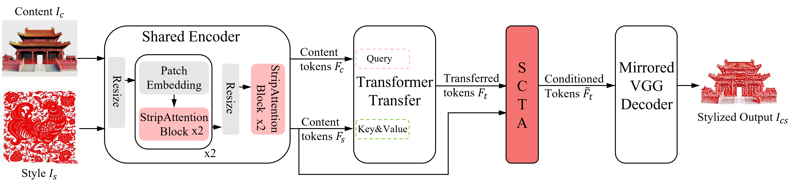
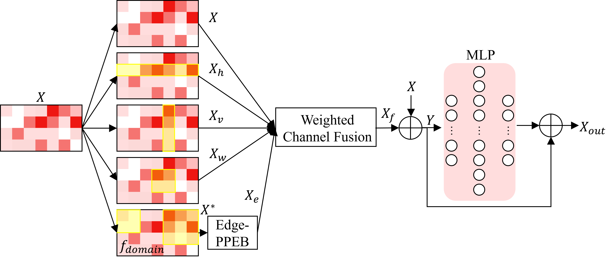

# Edge-Palette-SCTA

**Edge-Palette-SCTA: Edge-Palette Guided Chinese Paper-Cutting Style Transfer**

This repository contains the code, processed data, evaluation protocol, visual results, and reproducibility materials for our paper submitted to the image-processing track of the **IEEE 12th International Conference on Computer and Communications (ICCC 2026)**.



## Abstract

Chinese paper-cutting style transfer must preserve the semantic layout of a content image while producing clean cut-paper boundaries and a compact red-white appearance. Edge-Palette-SCTA addresses this problem with an edge-palette guided transformer framework. The model combines an **Edge Paper-Cut Prior Enhancement Block (Edge-PPEB)**, a **Style-Conditioned Texture Adapter (SCTA)**, and a paper-cut prior loss. Edge-PPEB strengthens boundary and hollow-region cues, SCTA provides bounded style-conditioned residual modulation, and the prior loss promotes morphology-aware edges and a compact red-white palette.



## Main Contributions

- **Edge-PPEB:** an edge-aware feature path that injects clean contour evidence into the transformer representation while retaining the existing attention candidates.
- **SCTA:** a compact style-conditioned residual adapter that uses style statistics to modulate transferred features without adding a second transformation network.
- **Paper-cut prior loss:** morphology-aware edge consistency and red-white palette compactness constraints tailored to Chinese paper-cutting.
- **Reproducible evaluation:** fixed content-style pair manifests, four reported metrics, ablation records, and qualitative comparisons with the original baseline, StyTR-2, CAST, S2WAT, and Aflutter Craft.

## Qualitative Results

The following examples use the same content-style pairs for every method. Columns are content, style, Edge-Palette-SCTA, original baseline, StyTR-2, CAST, S2WAT, and Aflutter Craft.


## Repository Layout

```text
data/       processed content and style images, manifests, preprocessing records
src/        Edge-Palette-SCTA and comparison-model source code
baselines/  source snapshots and usage notes for external comparison methods
scripts/    training, inference, metric, manifest, and asset-verification scripts
results/    metrics, fixed pairings, and qualitative comparison figures
tests/      lightweight project checks
docs/       experiment notes and reproducibility records
```

Large model parameters are distributed as GitHub Release assets instead of Git history. See [WEIGHTS.md](WEIGHTS.md) for the exact extraction locations. S2WAT is intentionally not mirrored in this release because its checkpoint is large; its official repository is linked there. The comparison source repositories are also listed there: [CAST_pytorch](https://github.com/zyxElsa/CAST_pytorch) and [Aflutter Craft](https://github.com/Aflutter-Craft/Network).

## Installation

The project uses **Python 3.12**. A CUDA-enabled PyTorch installation is recommended for inference and training.

```powershell
python -m venv .venv
.\.venv\Scripts\Activate.ps1
python -m pip install --upgrade pip
pip install torch torchvision tqdm pillow numpy scipy scikit-image lpips
```

The source snapshots under `src/` and `baselines/` retain their own dependency notes where available. For an initial CPU-side integrity check:

```powershell
python scripts/verify_project_assets.py
```

## Download Weights

Download the available ZIP assets from the [v1.0.0 release](https://github.com/FishSafe1896/Edge-Palette-SCTA/releases/tag/v1.0.0) and extract them according to [WEIGHTS.md](WEIGHTS.md). The release includes the final `EPS-SCTA_ours_best` checkpoint and the available comparison-model checkpoints. S2WAT parameters are obtained from its official repository. Ablation checkpoints are intentionally excluded.

## Inference

After extracting the final model checkpoint and VGG weight, run a manifest-based inference pass:

```powershell
python scripts/infer_manifest.py `
  --manifest_csv data/manifests/test_pairs.csv `
  --output_dir results/inference/ours `
  --checkpoint_import_path checkpoints/ours_EPS-SCTA_best_checkpoint.pkl `
  --device cuda `
  --ppeb_mode edge `
  --batch_size 1
```

The manifest records the content-style pairing protocol. Use `--device cpu` for a dependency-only smoke test. External-model inference uses `scripts/infer_external_manifest.py` and the corresponding source snapshot and parameters.

## Evaluation

The evaluation protocol reports:

- **SSIM:** structural similarity against the content image, higher is better.
- **LPIPS-content:** deep perceptual distance to the content image, lower is better.
- **FID:** distributional distance between generated results and the paper-cutting style set, lower is better.
- **Colors:** dominant color count, lower indicates a more compact palette.

```powershell
python scripts/metrics_full.py --help
```

All reported pairings and metric tables used in the paper are kept under `results/`.

## Citation

If this repository contributes to your research, please cite the paper:

```bibtex
@inproceedings{edgepalettescta2026,
  title     = {Edge-Palette-SCTA: Edge-Palette Guided Chinese Paper-Cutting Style Transfer},
  booktitle = {Proceedings of the IEEE 12th International Conference on Computer and Communications (ICCC)},
  year      = {2026},
  note      = {Image Processing Track}
}
```

## 中文说明

本仓库对应论文 **《Edge-Palette-SCTA: Edge-Palette Guided Chinese Paper-Cutting Style Transfer》**，面向 **IEEE 12th International Conference on Computer and Communications (ICCC 2026)** 图像处理方向，包含模型代码、处理后的数据集、固定配对信息、量化结果、可视化结果和复现实验脚本。

模型的主要创新包括：

- **Edge-PPEB**：在保持注意力候选结构的同时引入边缘感知特征路径，增强轮廓和镂空区域线索。
- **SCTA**：使用风格统计量对传输特征进行有界残差调制，实现紧凑的风格条件控制。
- **Paper-cut prior loss**：结合形态学边缘一致性与正红色、白色紧凑调色板约束。
- **可复现实验协议**：固定 content-style 配对、SSIM、LPIPS-content、FID、Colors 四项指标、消融记录以及多模型可视化结果。

大体积权重不放入 Git 历史，而是放在 GitHub Release 中。请阅读 [WEIGHTS.md](WEIGHTS.md) 完成下载和解压。S2WAT 权重体积较大，本仓库不镜像上传，改为提供其官方 GitHub 地址。消融实验权重不在发布包中。

使用 Python 3.12 安装依赖后，可先运行 `python scripts/verify_project_assets.py` 检查数据与代码，再根据上面的命令进行推理。完整的模型权重位置和 Release 附件名称见 [WEIGHTS.md](WEIGHTS.md)。
